# Real-world-next-app
https://github.com/reck1ess/next-realworld-example-app

## Api server
`https://conduit.productionready.io/api` 

- api: https://github.com/gothinkster/realworld/tree/master/api

## Main feature

### General functionality:
* Authenticate users via JWT (login/register pages + logout button on settings page)
* CRU* users (sign up & settings page - no deleting required)
* CRUD Articles
* CR*D Comments on articles (no updating required)
* GET and display paginated lists of articles
* Favorite articles
* Follow other users

### The general page breakdown
* Home page (URL: /)
  * List of tags
  * List of articles pulled from either Feed, Global, or by Tag
  * Pagination for list of articles
* Sign in/Sign up pages (URL: /user/login, /user/register)
  * Use JWT (store the token in localStorage)
* Settings page (URL: /user/settings )
* Editor page to create/edit articles (URL: /editor/new, /editor/article-slug-here)
* Article page (URL: /article/article-slug-here)
  * Delete article button (only shown to article's author)
  * Render markdown from server client side
  * Comments section at bottom of page
  * Delete comment button (only shown to comment's author)
* Profile page (URL: /profile/username-here, /profile/username-here?favorite=true)
  * Show basic user info
  * List of articles populated from author's created articles or author's favorited articles


## Next 공식 문서
https://nextjs.org/

# 1일차 학습
제대로 해놓은 코드를 들여다 보는데 예상했던것처럼 쉽지가않다!!


### STEP1: Create Next app
```
npx create-next-app real-app
cd real-app
yarn dev
```

### STEP2: 프로젝트 기본구조 따라하기
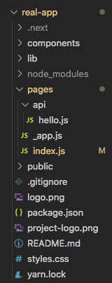

### STEP3: pages 폴더 보기
[참고](https://github.com/Road-of-CODEr/we-hate-js/blob/master/Front-End/Next.js/basicStructure.md)

* _app.js: 리액트를 커스텀 하는 곳

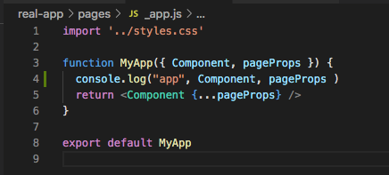
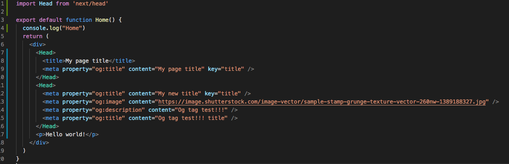

이렇게 두 컴포넌트가 있다치면 __app.js가 최상단 컴포넌트인 것을 console.log를 찍어보면 알 수 있다. 

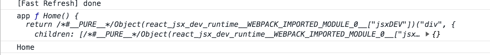

그래서 global css같은걸 입힐땐 _app.js에서 처리하면 된다. 

화면을 먼저 정의하고 각 페이지의 url에 따라서 페이지 구성을 먼저함. 각 페이지내의 컴포넌트는 컴포넌트 폴더안에 있음

* page에서 data fetching:
  * 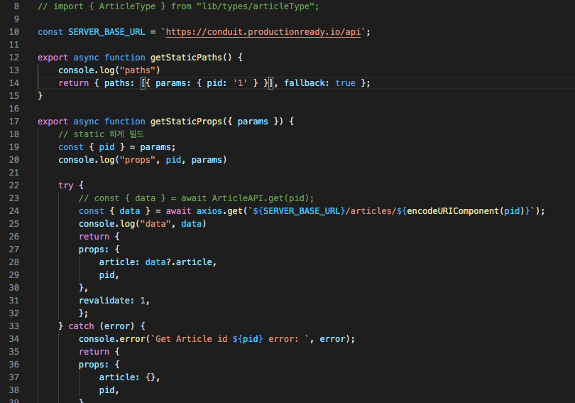
    이 코드를 보자. 
    path에 param으로 미리 빌드할 pid를 주지 않으면 먼저 빌드를 해놓지 않는데, pid를 주면 static하게 빌드시에 미리 generation한다. 
  * 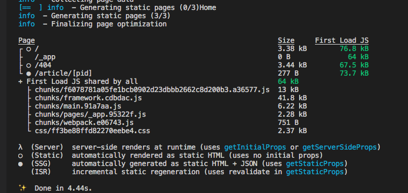
  * 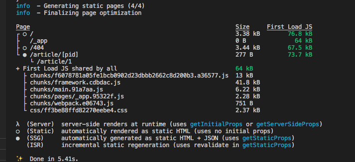
    [참고자료](https://github.com/Road-of-CODEr/we-hate-js/blob/master/Front-End/Next.js/basicFeatures/dataFetching/getStaticPaths.md)

  * lib/api로 정리해도 기존처럼 axios post하는 부분은 클라이언트에서 처리한다. 
    * 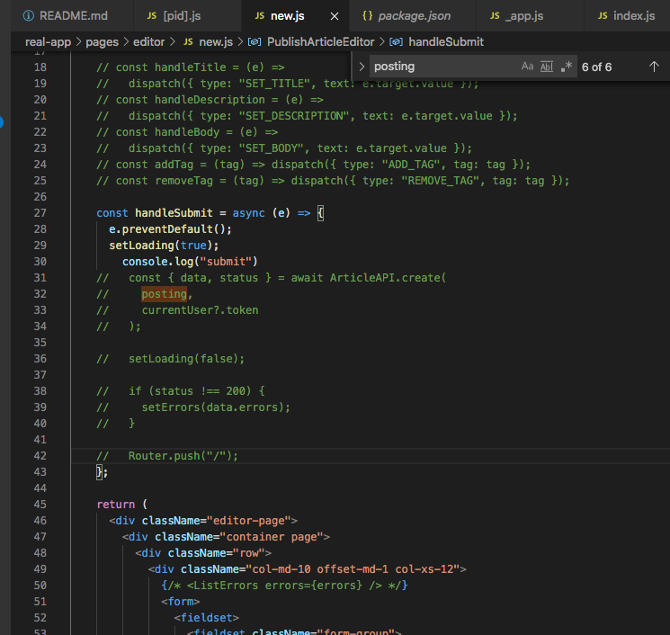
    * 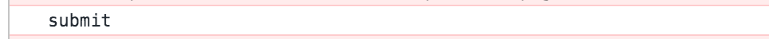
    * 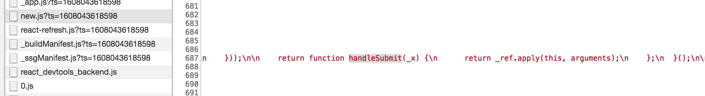
    
### lib
- api 폴더: 리소스별? api 콜을 정리해둠


# 2일차 학습
오늘은 또 내가 뭘 모르고 또 배울련지.... 대학원 안가도 되겠다... 개발자는 학위안나오는 종신형 석박과정....

### React Hooks
리액트의 훅스에 대해서 제대로 정리를 해본다. lib에서 customhooks를 쓰고 있던데, 실제로 사용해본적이 없어서 보려고 한다. [공식문서](https://reactjs.org/docs/hooks-intro.html) 

[내 블로그](https://mytutorials.tistory.com/187)

오늘은 하다보니까 훅스만 보게됬다!

# 3일차 학습
전체적인 포맷을 잡아보도록 하겠다!

1. pages 폴더 최상단에 있는 것들: index.js, _app.js, _document.js
  
  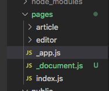

   - [index.js 의 역할](https://nextjs.org/docs/api-reference/next/image#usage)


   - [_app.js 의 역할](https://nextjs.org/docs/advanced-features/custom-app)
     - Next.js는 `App`을 통해서 화면을 초기화 함. 
       - 페이지 간의 레이아웃 유지
       - 페이지를 이동할때 state를 유지
       - 글로벌 css 추가 등
     - `./pages/_app.js`에 정의 할 수 있다. 
     - 예제 형태
        ```javascript
        function MyApp({ Component, pageProps }) {
          return <Component {...pageProps} />
        }
        ```
        - Component는 현재 활성화 된 page이고, routes내를 이동할때 Component는 새로운 `page`로 바뀐다. 그래서 props가 다 각 페이지로 전달이 된다. 
        - `pageprops`는 각 페이지를 위해 preload되는 데이터다. getStaticPaths, getStaticProps, getServerSideProps같은 걸로...! (정확한 동작 흐름은 나중에 next 뜯어볼때 보기) 
        


   - [_document.js 의 역할](https://nextjs.org/docs/advanced-features/custom-document)
     - Next.js에서 default `document`를 주지만, 정의를 더 하고 싶을 때 쓰는 것. 
     - `./pages/_document.js`에 정의 할 수 있다. 
     - 특히 document페이지에서 쓰이는 `<Head />`는 다른 페이지에서 쓰이는 `next/head`랑은 다르다. 여기의 `<Head />`는 전체 페이지에서 공통적으로 쓰이는 애들만 포함 시켜야한다.
     - server에서만 렌더링 되는 부분이다. 
     - `<Main />` 밖에 있는 리액트 컴포넌트는 브라우저에서 초기화 되지 않기 때문에, 여기에 애플리케이션의 로직을 포함시키면 안된다. 공통적인 메뉴나 툴바같은건 `App`에서 정의해라
     - 아래처럼 _document.js 를 정의했다. 
        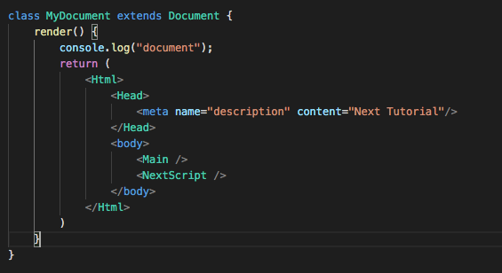

        암만 refresh를 해도 반영이 안되서 보니까 dev 서버를 끄고 다시켜주면 됬다. 

        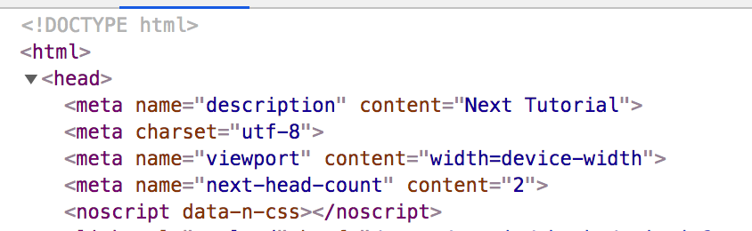

        그러면 이제 내가 추가한 메타 태그가 포함이 되서 보였다. 그외에도 기초적인 것들은 포함을 시켜주는 것 같긴하다. 

    - _app.js -> page 컴포넌트(index.js, artice/[pid].js) -> _document.js 순으로 접근
  
  
  - 현재 파악한 흐름
    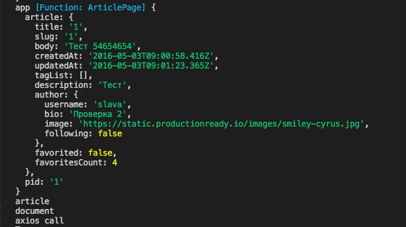

    - 페이지 요청 -> pages의 각 컴포넌트내에서 datafetching 요소가 있으면 처리하고, 없으면 빈객체 -> 이 값을 _app.js에서 pageprops로 요청한 page 컴포넌트에 넘겨준다 -> _document.js에서 해당하는 doucment요소를 감싸서 응답해준다. 
